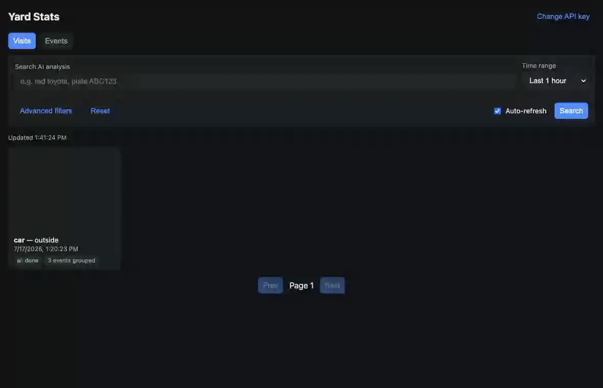

# Yard Stats + Vehicle Metadata

Extends an existing [Frigate](https://frigate.video) NVR setup with a pipeline that logs yard/
driveway activity and uses local vision-language models to describe vehicles (color, body type,
make, license plate) and people passing through camera zones — no cloud API calls, and nothing
here ever touches Frigate's own database.



*The demo above uses synthetic placeholder data (a throwaway local instance, no real camera
footage) — just to show the UI itself in motion.*

## What it does

- Listens to Frigate's `frigate/events` MQTT topic and records every tracked object (car, truck,
  person, dog, ...) to Postgres, and separately to `frigate/reviews` to group multiple detections
  Frigate's own tracker considers the same real-world activity (occlusion/re-ID, label flicker)
  into a "visit".
- Crops each event out of the recording (via ffmpeg, using Frigate's own detection region) and
  stores the result — no image analysis yet at this point. Optionally stores the clip itself
  (per-event and/or per-visit) and sends Telegram notifications (photo/video per event, or one
  summary + composite preview grid/GIF per visit).
- An internal AI-stage poll loop (`ai_worker.py`, off by default) sends the cropped image (or, for
  a visit, a composite grid of frames sampled across its whole span) to a locally-hosted VLM, using
  whatever prompt `profiles.yaml` defines for that Frigate object type — a vehicle prompt asking
  for color/body-type/plate, a person prompt asking for a clothing description, and so on. Frigate's
  own LPR read is kept alongside whatever the VLM says as a cross-check.
- A read/query/report/AI-queue API on `ingest-worker` (events, visits, sightings, aggregate stats,
  HTML report generation, plus the AI-stage queue mechanics the internal stage uses and n8n or any
  other caller can use instead) and a natural-language
  Q&A workflow sit on top. The static web report UI shown above (`/ui`, no build step) browses the
  same data — Events or Visits view, filters, a media lightbox with video/image/preview-GIF toggle.
- A configurable retention sweep deletes data (DB rows and any stored video files) past a set age
  (default 12 months) automatically, plus an ad-hoc purge API for a caller-chosen cutoff.
- An admin dashboard (`/ui/admin`) covers operational health: queue status per stage with a
  one-click "requeue failed" action, semantic-search embedding coverage/backfill/reindex,
  disk/database size, and a preview-then-confirm retention purge.

## Documentation

This README covers the overview and quick start. For a deeper, plain-language walkthrough of any
one piece (aimed at readers who haven't necessarily used that tool before), see **[`docs/`](docs/)**:

| Guide | For when you want to understand... |
|---|---|
| [`docs/docker.md`](docs/docker.md) | Docker & Docker Compose basics, this project's compose profiles, everyday commands |
| [`docs/frigate.md`](docs/frigate.md) | The parts of `frigate.conf` this project actually depends on — streams, zones, LPR, recording retention |
| [`docs/n8n.md`](docs/n8n.md) | Importing and wiring up the n8n workflows, credentials, testing before enabling |
| [`docs/configuration.md`](docs/configuration.md) | Every `.env` setting, grouped by feature, with a suggested rollout order |
| [`docs/web-ui.md`](docs/web-ui.md) | A tour of the web report UI shown above |
| [`docs/troubleshooting.md`](docs/troubleshooting.md) | Common "it's not doing what I expected" situations and their fixes |

For the full architectural write-up — every queue stage, API endpoint, and the real production
issues that shaped this design — see [`CLAUDE.md`](CLAUDE.md).

## Architecture

```
Frigate (MQTT frigate/events, every object label: car/truck/person/dog/...
         + frigate/reviews, Frigate's own review/alert grouping)
   │
   ▼
ingest-worker/  (Python, one container, no LLM calls)
   - MQTT subscribers -> Postgres (raw_events unfiltered by label, visits from the review stream)
   - Poll loops (crop, video, alert-video, visit-preview): claim work race-safely
     (FOR UPDATE SKIP LOCKED), fetch from Frigate, crop/download via ffmpeg, store the result,
     fire-and-forget Telegram notifications
   - Applies its own Postgres schema on startup and runs retention cleanup on a schedule
   - FastAPI surface (Swagger UI at :8080/docs): unauthenticated admin/debug endpoints
     (/health, /status, /crop/{id}, /retention/run) plus an X-API-Key-protected API
     (/events, /visits, /sightings, /stats, /reports, /ai-queue/*, /media/video) that n8n and
     other consumers call instead of querying Postgres directly, plus a static web report UI
     at /ui over that same API
   │  (crop_status = 'done')
   ▼
AI stage (ai_worker.py, an internal ingest-worker poll-loop thread, off by default -- or a custom
          n8n workflow/script calling the same /ai-queue/* API instead)
   - claims a batch, calls the VLM per profiles.yaml's prompt for that object type, writes the
     sighting back
   │
   ▼
Daily/alerts report + Q&A workflows (n8n) -- read-only, call ingest-worker's report/query API
```

Three independent retry-with-backoff queue stages live on `raw_events` (crop, video, AI) and two
more on `visits` (video, preview grid/GIF) — `ingest-worker` owns all of them mechanically,
including the AI stage's own policy (parallel limit, stale/max-age cutoffs, all tunable in
`profiles.yaml`/`.env`) when using the built-in `ai_worker.py`; an external caller driving the same
`/ai-queue/*` API instead (e.g. a custom n8n workflow) would decide that policy itself via query
params. See [`CLAUDE.md`](CLAUDE.md) for the full write-up of every stage, endpoint, and the
production issues that shaped this design.

## Semantic search — finding things by meaning, not exact words

Every AI-analyzed sighting has a short written description (e.g. `"silver sedan, four-door, no
visible damage, plate reads 7ABC123"` for a vehicle, or `"person in a dark jacket carrying a small
box"` for a person). The plain `GET /events?q=...` search only matches if your search text is a
literal substring of that description — search for `"package"` and a sighting that says `"box"`
instead simply won't show up, even though a human would obviously call that the same thing.

**Semantic search fixes that** by comparing *meaning* instead of *spelling*. Every sighting's
description text is run through an embedding model, which turns the sentence into a list of ~1000
numbers (a "vector") that represents its meaning — sentences with similar meaning end up as nearby
points in that number-space, regardless of which exact words were used. A search query gets turned
into a vector the same way, and the database just finds whichever stored sightings' vectors are
closest to it.

**Example:**

| You search for | It finds sightings whose description actually said |
|---|---|
| `"someone dropping off a delivery"` | `"person carrying a small brown box walks to the front door"` |
| `"a beat-up old pickup"` | `"faded red pickup truck, visible rust on the rear panel"` |
| `"kids playing outside"` | `"two children running across the driveway"` |

None of those share a single matching word with the search text — a plain text search would find
nothing, but semantic search finds them because the *meaning* lines up.

This is exposed as `POST /search/semantic` (send a query, get back the closest-matching sightings
ranked by similarity), and it's also one of the tools the natural-language **Q&A workflow** (n8n)
can reach for on its own — ask it something vague like *"anything unusual in the yard today?"* and
it can fall back to meaning-based search instead of requiring an exact keyword, while something
like *"cars seen last week"* still goes through the normal structured filters (time range,
object type) since that maps cleanly to real fields.

Under the hood this uses **pgvector** (a Postgres extension), not a separate vector database — the
embeddings live as one more column right alongside everything else in the same universal `sightings`/
`visit_sightings` tables, so there's no extra service to run or keep in sync. The actual embedding
model is one more slot on your locally-hosted VLM setup (e.g.
[`llama-slot-proxy`](https://github.com/shuricksumy/llama-slot-proxy)) — see
[`docs/configuration.md`](docs/configuration.md) for `LLAMA_PROXY_EMBED_PATH`/
`EMBEDDING_DIMENSIONS`, and `POST /embeddings/backfill` to fill this in for sightings that already
existed before semantic search was turned on.

## Repository layout

```
frigate/                        # main project folder -- the pipeline + Frigate's own config
  docker-compose.yml             # ONE file, three Compose profiles: pipeline + nvr + mqtt
  .env.example                    # ONE shared template -- covers both stacks below (see comments)
  profiles.yaml                    # internal AI stage's object-type/prompt/model config, bind-mounted
  sql/queue-debug.sql             # manual check/fix/reset queries (raw_events AND visits queues)
  ingest-worker/                  # the Python service, including its static/ web report UI
  mosquitto/                      # optional local MQTT broker (--profile mqtt), for dev/testing
  backup-postgres-projects.sh
  frigate.conf                     # Frigate's own config, read by the "frigate" service/profile
n8n/                             # importable workflow JSON (reports, Q&A -- AI analysis is internal, see ai_worker.py)
docs/                            # plain-language guides -- see Documentation above
```

Despite sharing one `docker-compose.yml`, `pipeline` (postgres-projects + ingest-worker) and `nvr`
(Frigate itself) still deploy to two different hosts — Frigate's stack stays on the camera/NVR
host; the pipeline runs wherever you run n8n. `mqtt` is a third, fully optional profile (a local
Mosquitto broker) for a from-scratch dev stack with no external broker dependency. See
[`docs/docker.md`](docs/docker.md) for the full explanation of how the profiles work.

## Prerequisites

- Frigate **0.16+**, with `lpr.enabled: true` and a full-resolution record stream (separate from
  the low-res detect stream) — clips and crops come from the record stream.
- A locally-hosted OpenAI-compatible VLM endpoint (e.g. a `llama.cpp` server, or
  [`llama-slot-proxy`](https://github.com/shuricksumy/llama-slot-proxy) — see Related projects
  below) reachable over HTTP.
- (Optional) An n8n instance, if you want the daily/alerts report emails or the Q&A webhook — not
  required for the core pipeline, which analyzes events internally via `ai_worker.py`.
- Docker + Docker Compose.

## Quick start

1. `cd frigate && cp .env.example .env` and fill in the required values (Postgres password, MQTT
   broker, Frigate's API base URL, an `API_KEY` you make up) — see
   [`docs/configuration.md`](docs/configuration.md) for what everything else does; most settings
   are optional and off by default.
2. `docker compose --profile pipeline up -d` — pulls `ingest-worker`'s image from GHCR (built
   automatically, gated on its test suite passing). See [`docs/docker.md`](docs/docker.md) if
   any of this is new to you.
3. Open `http://<host>:8080/ui` (or `/docs` for the raw API) to confirm it's ingesting and
   cropping real events — see [`docs/web-ui.md`](docs/web-ui.md) for a tour.
4. Turn on AI analysis: set `ai_events_stage_enabled: true` under `defaults` (or per object type)
   in `frigate/profiles.yaml`, and point `LLAMA_PROXY_BASE_URL` (`.env`) at your VLM host —
   `ai_worker.py` then claims cropped events, calls the VLM, and writes each sighting back, no n8n
   required. n8n is optional, for the daily/alerts report emails and the Q&A webhook — see
   [`docs/n8n.md`](docs/n8n.md) if you want those.
5. Separately, if you also need Frigate itself: same `frigate/.env` on the NVR host, then
   `docker compose --profile nvr up -d`. See [`docs/frigate.md`](docs/frigate.md) for the parts of
   `frigate.conf` this project actually depends on.

Something not behaving as expected? [`docs/troubleshooting.md`](docs/troubleshooting.md) covers
the most common situations.

## Data retention & privacy

Plate text and clips are treated as semi-sensitive — `ingest-worker` runs a retention sweep
(`RETENTION_MONTHS`, default 12) on its own schedule, deleting both the DB rows and any stored
video files, rather than accumulating data indefinitely. `POST /retention/purge` (also exposed as
a button on the [admin dashboard](docs/web-ui.md#admin-dashboard)) is an ad-hoc counterpart for
purging on a caller-chosen cutoff (dry-run by default) — `only_media=true` (the default) keeps every row
and its AI analysis text/plate reads searchable forever, only clearing stored video/images/GIFs;
`only_media=false` deletes the rows entirely. See
[`frigate/sql/queue-debug.sql`](frigate/sql/queue-debug.sql) for manual checks/fixes/resets if you
need to inspect or intervene by hand.

## Related projects

This is one project among several in the author's homelab, kept deliberately decoupled from each
other (own containers, own Postgres schema — see `CLAUDE.md`), but designed to plug together:

- [**llama-slot-proxy**](https://github.com/shuricksumy/llama-slot-proxy) — a multi-model
  `llama.cpp` slot proxy, one URL path segment per model (chat/VLM/embedding). This is the
  `LLAMA_PROXY_BASE_URL` this project's AI stage and n8n workflows call for VLM/OCR/embedding
  inference — see [`docs/configuration.md`](docs/configuration.md#internal-ai-stages)
  and `frigate/profiles.yaml`.
- [**llama-service**](https://github.com/shuricksumy/llama-service) — the underlying local LLM
  serving setup this pipeline's VLM/embedding calls ultimately run on.

## License

MIT — see [LICENSE](LICENSE).
